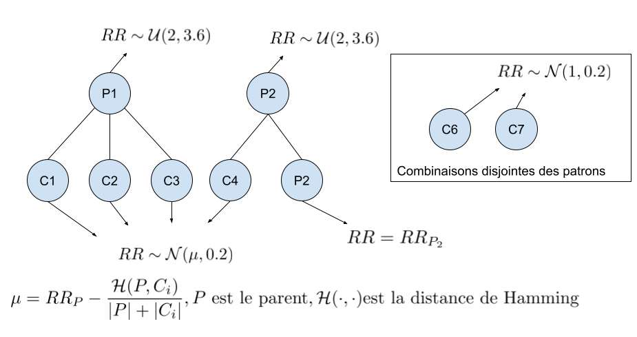

# Data simulator for polypharmacies / drug combinations

## TL;DR
```python create_dataset.py [--config path/to/config.json --seed your_seed]```

Template of `config.json` in `configs/`

## Example end result
| Rx1 | Rx2 | Rx3 | Rx4 | ... | RxN | RR   |
|-----|-----|-----|-----|-----|-----|------|
| 1   | 0   | 0   | 1   | ... | 0   | 3.00 |
| 0   | 1   | 0   | 1   | ... | 1   | 2.67 |
| 0   | 1   | 1   | 1   | ... | 1   | 3.14 |
| ⋮   | ⋮   | ⋮   | ⋮   | ... | ⋮   | ⋮    |
| 1   | 1   | 1   | 1   | ... | 0  | 1.85|


## Abbreviations
* RR = Relative risk

## Configuration
* `file_identifier`: File identifier for the output data
* `output_dir`: Directory identifier for the output data
* `seed`: Random seed
* `n_combi`: Number of unique drug combinations to produce
* `n_rx`: Number of individual drugs (equals the number of columns in the generated dataset)
* `mean_rx`: Mean number of drugs per combination
* `use_gpu`: Indicate whether to use GPU for data generation, if available

* `patterns`: Sub-configuration for the dangerous patterns
    * `n_patterns`: Number of dangerous patterns to generate
    * `min_rr`: Minimal RR for patterns
    * `max_rr`: Maximal RR for patterns
    * `mean_rx`: Mean number of drugs per dangerous patterns

* `disjoint_combinations`: Sub-configuration for drug combinations disjoint from the dangerous patterns 
    * `mean_rr`: Gaussian mean for the RR of these combinations
    * `std_rr`: Gaussian standard deviation of these combinations


* `inter_combinations`: Sub-configurtion for drug combinations which intersect with dangerous patterns
    * `std_rr`: Gaussian standard deviation of these combinations


## Distributions utilisees
### Patrons
Ici, on utilise des distributions uniformes dans l'intervalle [`patterns:min_rr`, `patterns:max_rr`] afin de faciliter la creation de jeux de donnees plus ou moins difficiles

### Combinaisons avec intersection avec un patron
On utilise une normale d'ecart-type`inter_combinations:std_rr` et avec une moyenne calculée a l'aide de la similarite entre les combinaisons et les patrons dangereux.

### Combinaisons disjointe des patrons
On utilise une normale de moyenne `disjoint_combinations:mean_rr` et d'écart-type `disjoint_combinations:std_rr`. Les combinaisons reliées à un patron seront donc plus proches d'un RR predeterminé par la configuration.


## Idee generale
1. Générer des patrons dangereux et des risques associés de manière aléatoire
2. Générer des combinaisons
3. Générer des risques bases sur la similarité entre les combinaisons et les patrons.

On peut voir ça comme une coupe qui déborde dans d'autres coupes, ou bien un arbre. Chaque patron est une racine de laquelle découlent plusieurs combinaisons. Une combinaison est associée à un patron si le patron est son voisin le plus proche selon la distance de Hamming. Cependant, une combinaison peut être mise dans un autre ensemble à part si aucun medicament n'est partagé entre la combinaison et le patron le plus proche.




## Troubleshooting
1. Si bloque sur "Regenerating bad combinations...", il est possible que le nombre de combinaisons possibles "en moyenne" soit plus petit que le nombre de combinaisons que l'on tente de générer. Autrement dit, on devrait augmenter le nombre de Rx moyen par combinaisons, sinon on est pris dans une boucle infinie.
Pour garantir une boucle finie, il suffit d'avoir que

$$ C_k(n) = {n \choose k} = \frac{n!}{k!(n-k)!} $$

où $n$ est le nombre de Rx, $k$ est le nombre de Rx moyen par combinaison. Cette condition est suffisante, mais pas nécessaire, comme on travaille en espérance.
